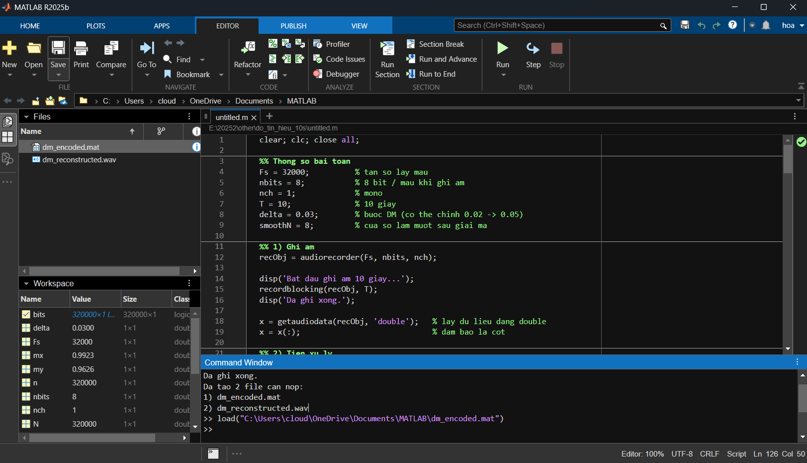
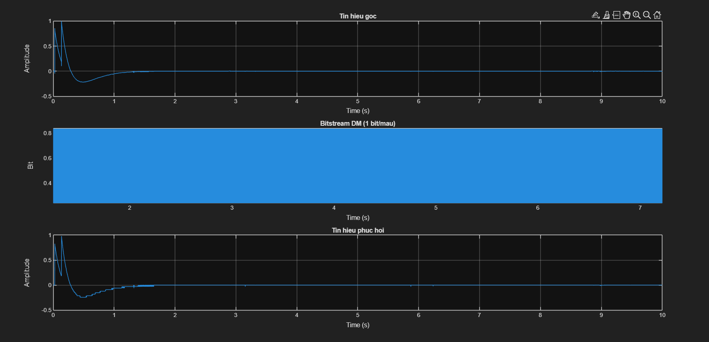

# Mã hóa âm thanh bằng phương pháp Delta Modulation (DM) trong MATLAB

## Giới thiệu

Đây là bài tập mô phỏng quá trình **mã hóa** và **khôi phục tín hiệu âm thanh** bằng phương pháp **Delta Modulation (DM)** trong MATLAB.

Chương trình thực hiện các bước chính:

- Ghi âm tín hiệu âm thanh trong **10 giây**
- Sử dụng tần số lấy mẫu **32 kHz**
- Ghi âm với độ phân giải **8 bit / mẫu**
- Mã hóa tín hiệu theo phương pháp **Delta Modulation**
- Biểu diễn mỗi mẫu bằng **1 bit**
- Lưu chuỗi bit sau mã hóa vào file `.mat`
- Giải mã lại tín hiệu từ bitstream
- Xuất tín hiệu phục hồi thành file `.wav`

Mục tiêu của bài là minh họa nguyên lý hoạt động cơ bản của Delta Modulation trong xử lý tín hiệu số.

---

## Mục tiêu bài toán

Bài toán gồm 2 phần chính:

### 1. Mã hóa tín hiệu âm thanh

Từ tín hiệu âm thanh đầu vào, chương trình sẽ:

- so sánh giá trị mẫu hiện tại với giá trị tái tạo trước đó
- nếu tín hiệu tăng thì ghi bit `1`
- nếu tín hiệu giảm thì ghi bit `0`

Kết quả là mỗi mẫu âm thanh chỉ được biểu diễn bằng **1 bit**.

### 2. Khôi phục tín hiệu

Từ chuỗi bit đã mã hóa, chương trình:

- cộng thêm `delta` nếu gặp bit `1`
- trừ đi `delta` nếu gặp bit `0`

Từ đó tái tạo lại tín hiệu gần đúng với tín hiệu gốc và lưu thành file `.wav` để nghe lại.

---

## Công nghệ sử dụng

- **MATLAB**
- Các hàm cơ bản:
  - `audiorecorder`
  - `getaudiodata`
  - `save`
  - `movmean`
  - `audiowrite`

Phiên bản bài làm cơ bản này không yêu cầu toolbox nâng cao.

---

## Cấu trúc thư mục

```text
.
├── assets/
│   └── images/
│       ├── matlab-result.png
│       └── sample-run.png
├── dm_encoded.mat
├── dm_reconstructed.wav
├── README.md
└── untitled.m

```

## Kết quả minh họa

### 1. Một lần chạy mẫu trong MATLAB



### 2. Kết quả đồ thị sau khi mã hóa và khôi phục

